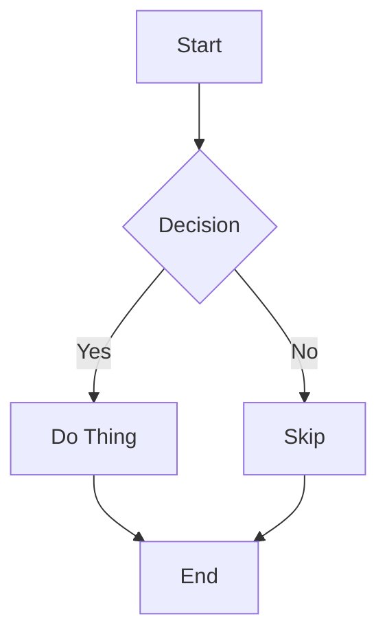
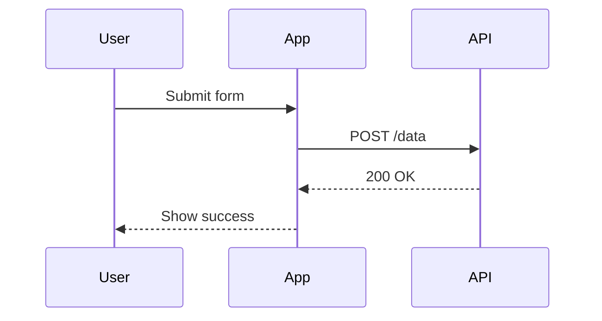
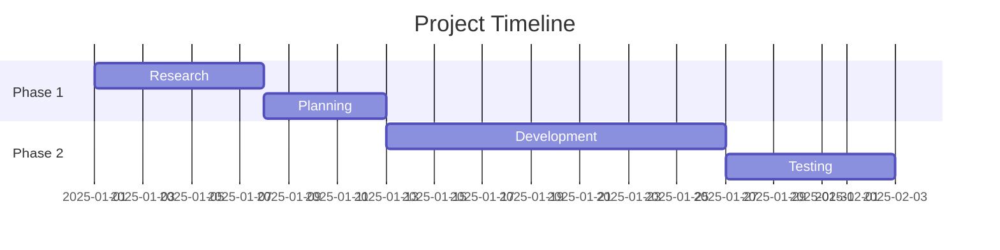
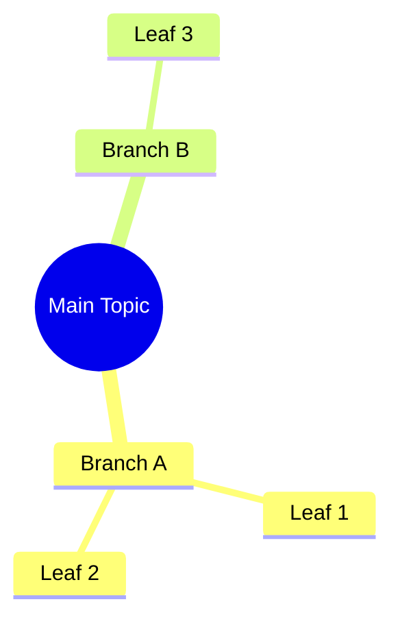

# Obsidian Markdown Style Guide

> A personal reference for consistent formatting, color usage, and structure across all notes.

---

## Table of Contents

- [[#1. Headings]]
- [[#2. Text Formatting]]
- [[#3. Lists]]
- [[#4. Links & Embeds]]
- [[#5. Callouts]]
- [[#6. Code]]
- [[#7. Tables]]
- [[#8. Tags & Metadata]]
- [[#9. Frontmatter (YAML)]]
- [[#10. Color Conventions]]
- [[#11. Highlights]]
- [[#12. Footnotes & Comments]]
- [[#13. Diagrams (Mermaid)]]
- [[#14. Math (LaTeX)]]
- [[#15. Task & Project Conventions]]
- [[#16. File & Folder Naming]]
- [[#17. Dataview Snippets]]

---

## 1. Headings

Use headings hierarchically. Never skip levels.

```
# H1 — Note title (used once, at the top)
## H2 — Major sections
### H3 — Subsections
#### H4 — Minor subsections (use sparingly)
```

**Rules:**

- Only one `# H1` per note — it should match the filename.
- Leave a blank line before and after every heading.
- Don't use bold (`**`) as a substitute for headings.

---

## 2. Text Formatting

|Style|Syntax|Use For|
|---|---|---|
|**Bold**|`**text**`|Key terms, important warnings|
|_Italic_|`*text*`|Titles, emphasis, definitions|
|~~Strikethrough~~|`~~text~~`|Deprecated info, crossed-off ideas|
|==Highlight==|`==text==`|Critical info, review flags|
|`Inline code`|`` `text` ``|Commands, filenames, variables|
|**_Bold italic_**|`***text***`|Use very rarely|

**Rules:**

- Bold is for **importance**, not decoration.
- Italics for _titles_ (books, films) and first use of a defined term.
- Limit highlights — if everything is highlighted, nothing is.

---

## 3. Lists

### Unordered Lists

Use `-` (not `*` or `+`) for consistency.

```markdown
- Item one
- Item two
  - Nested item (indent 2 spaces)
    - Deeper nest (indent 4 spaces)
```

### Ordered Lists

```markdown
1. First step
2. Second step
3. Third step
```

### Task Lists

```markdown
- [ ] Unchecked task
- [x] Completed task
- [/] In progress (Obsidian renders this)
- [-] Cancelled
- [!] Important
- [?] Question / needs review
- [>] forwarding
- [<] scheduling

Extras
------
- [?] question
- [!] important
- [*] star
- ["] quote
- [l] location
- [b] bookmark
- [i] information
- [s] savings
- [I] idea
- [p] pros
- [c] cons
- [f] fire
- [k] key
- [w] win
- [u] up
- [d] down
```

- [ ] Unchecked task
- [x] Completed task
- [/] In progress (Obsidian renders this)
- [-] Cancelled
- [!] Important
- [?] Question / needs review
- [>] forwarding
- [<] scheduling

Extras
------
- [?] question
- [!] important
- [*] star
- ["] quote
- [l] location
- [b] bookmark
- [i] information
- [s] savings
- [I] idea
- [p] pros
- [c] cons
- [f] fire
- [k] key
- [w] win
- [u] up
- [d] down
---
**Rules:**

- Don't mix list types within one logical group.
- Keep list items parallel in structure (all verbs, or all nouns, etc.).

---

## 4. Links & Embeds

### Internal Links

```markdown
[[Note Name]]                     — Link to a note
[[Note Name|Display Text]]        — Link with alias
[[Note Name#Section]]             — Link to a heading
[[Note Name#^blockid]]            — Link to a block
```

### External Links

```markdown
[Display Text](https://url.com)
```

### Embeds

```markdown
![[Note Name]]                    — Embed a full note
![[Note Name#Section]]            — Embed a section
![[image.png]]                    — Embed an image
![[image.png|300]]                — Embed image at 300px width
![[Note Name#^blockid]]           — Embed a block
```

### Block References

Add `^blockid` at the end of a paragraph to give it a referenceable ID:

```markdown
This is an important paragraph. ^key-insight
```

Then reference it elsewhere with `[[Note#^key-insight]]`.

---

## 5. Callouts

Obsidian supports rich callout blocks. Syntax:

```markdown
> [!type] Optional Title
> Content goes here.
```

### Callout Types & Intended Use

```markdown
> [!note] Note
> General supplementary info.

> [!info] Info
> Neutral background context.

> [!tip] Tip
> Helpful suggestion or best practice.

> [!important] Important
> Must-know information.

> [!warning] Warning
> Potential issue or risk.

> [!danger] Danger
> Critical failure point or serious risk.

> [!example] Example
> Concrete illustration.

> [!question] Question
> Open question or thing to investigate.

> [!todo] To-Do
> Action items within a note.

> [!quote] Quote
> Attribution-worthy quotes.

> [!success] Success
> Outcome, resolved item, or completed milestone.

> [!failure] Failure
> What went wrong; post-mortem notes.

> [!abstract] Abstract / Summary
> TL;DR or executive summary.

> [!bug] Bug
> Known issue in code or a system.
```

> [!note] Note
> General supplementary info.

> [!info] Info
> Neutral background context.

> [!tip] Tip
> Helpful suggestion or best practice.

> [!important] Important
> Must-know information.

> [!warning] Warning
> Potential issue or risk.

> [!danger] Danger
> Critical failure point or serious risk.

> [!example] Example
> Concrete illustration.

> [!question] Question
> Open question or thing to investigate.

> [!todo] To-Do
> Action items within a note.

> [!quote] Quote
> Attribution-worthy quotes.

> [!success] Success
> Outcome, resolved item, or completed milestone.

> [!failure] Failure
> What went wrong; post-mortem notes.

> [!abstract] Abstract / Summary
> TL;DR or executive summary.

> [!bug] Bug
> Known issue in code or a system.
### Foldable Callouts

Add `+` (open by default) or `-` (collapsed by default):

```markdown
> [!note]- This is collapsed by default
> Hidden content here.

> [!tip]+ This is open by default
> Visible content here.
```

> [!note]- This is collapsed by default
> Hidden content here.

> [!tip]+ This is open by default
> Visible content here.
---

## 6. Code

### Inline Code

Use for filenames, commands, variable names, and short expressions:

```
Run `npm install` to get started.
```

### Fenced Code Blocks

Always specify a language for syntax highlighting:

````markdown
```python
def greet(name):
    return f"Hello, {name}!"
```

```javascript
const greet = (name) => `Hello, ${name}!`;
```

```bash
cd ~/Documents && ls -la
```

```sql
SELECT * FROM users WHERE active = true;
```

```json
{
  "name": "example",
  "version": "1.0.0"
}
```
````

---

## 7. Tables

```markdown
| Column A | Column B | Column C |
| -------- | -------- | -------- |
| Value 1  | Value 2  | Value 3  |
| Value 4  | Value 5  | Value 6  |
```

| Column A | Column B | Column C |
| -------- | -------- | -------- |
| Value 1  | Value 2  | Value 3  |
| Value 4  | Value 5  | Value 6  |
### Alignment

```markdown
| Left     | Center   | Right    |
| :------- | :------: | -------: |
| text     | text     | text     |
```

| Left | Center | Right |
| :--- | :----: | ----: |
| text |  text  |  text |

**Rules:**

- Use tables only for genuinely tabular data.
- Keep tables narrow — if a row needs 6+ columns, consider a different structure.
- Prefer Dataview for dynamic tables over manual ones.

---

## 8. Tags & Metadata

### Inline Tags

```markdown
#status/active
#type/reference
#topic/productivity
#project/website-redesign
#review
#fleeting
#literature
#permanent
```

### Tag Taxonomy Convention

```
#type/      — note type (reference, evergreen, fleeting, MOC, etc.)
#status/    — workflow state (active, archived, review, draft)
#topic/     — subject matter (philosophy, code, health, finance)
#project/   — project affiliation
#source/    — origin type (book, podcast, article, conversation)
```

---

## 9. Frontmatter (YAML)

Every note should begin with a YAML frontmatter block:

```yaml
---
title: "Note Title"
aliases:
  - "Alternative Name"
  - "Short Name"
created: 2025-01-15
modified: 2025-04-10
tags:
  - type/reference
  - topic/productivity
  - status/active
source: ""
author: ""
related:
  - "[[Another Note]]"
summary: "One sentence describing what this note is."
---
```

### Minimal Frontmatter (for quick notes)

```yaml
---
created: 2025-04-10
tags:
  - type/fleeting
---
```

---

## 10. Color Conventions

Use Obsidian's folder colors, note icons, or canvas colors with a consistent system.

### Semantic Color Mapping

|Color|Hex|Meaning / Use|
|---|---|---|
|🔴 Red|`#e03131`|Urgent, danger, blockers|
|🟠 Orange|`#e8590c`|In progress, warnings, caution|
|🟡 Yellow|`#f08c00`|Ideas, fleeting notes, to revisit|
|🟢 Green|`#2f9e44`|Completed, validated, healthy|
|🔵 Blue|`#1971c2`|Reference, research, informational|
|🟣 Purple|`#7048e8`|Creative, speculative, brainstorm|
|⚫ Gray|`#868e96`|Archived, inactive, deprecated|
|⚪ White|`#f1f3f5`|Neutral / default|

### Canvas Node Colors

In Obsidian Canvas, use the built-in color slots consistently:

```
Color 1 (Red)    — Urgent / Problem nodes
Color 2 (Orange) — In Progress
Color 3 (Yellow) — Ideas / Speculative
Color 4 (Green)  — Resolved / Done
Color 5 (Cyan)   — Resources / Links
Color 6 (Purple) — Concepts / Theory
```

---

## 11. Highlights

Use `==highlight==` sparingly. Assign meaning to highlight color via a CSS snippet (if using a theme that supports it):

```
==Default yellow==  — Key term or insight to remember
```

==Default yellow==  — Key term or insight to remember

With the **Highlightr** plugin, you can use colored highlights:

```
Use Highlightr plugin hotkeys to apply:
  🟡 Yellow  — Key concept
  🔵 Blue    — Supporting evidence
  🟢 Green   — Actionable / to apply
  🔴 Red     — Disagree / challenge this
  🟣 Purple  — Quote worth keeping
```

---

## 12. Footnotes & Comments

### Footnotes

```markdown
This claim needs a source.[^1]

[^1]: Author, *Title*, Year. https://example.com
```

This claim needs a source.[^1]

[^1]: Author, *Title*, Year. https://example.com
### Hidden Comments (not rendered)

```markdown
%% This is a comment — visible in edit mode, hidden in reading mode %%

%%
Multi-line comment.
Great for draft notes or reminders to self.
%%
```

%% This is a comment — visible in edit mode, hidden in reading mode %%

%%
Multi-line comment.
Great for draft notes or reminders to self.
%%

---

## 13. Diagrams (Mermaid)

Obsidian natively renders Mermaid diagrams.

### Flowchart

````markdown

````


### Sequence Diagram

````markdown

````


### Gantt Chart

````markdown

````


### Mind Map

````markdown

````


---

## 14. Math (LaTeX)

Obsidian supports LaTeX via MathJax.

### Inline Math

```markdown
The formula is $E = mc^2$ where $c$ is the speed of light.
```

The formula is $E = mc^2$ where $c$ is the speed of light.
### Block Math

```markdown
$$
\frac{d}{dx}\left( \int_{0}^{x} f(u)\, du\right) = f(x)
$$
```

$$
\frac{d}{dx}\left( \int_{0}^{x} f(u)\, du\right) = f(x)
$$

```markdown
$$
\begin{aligned}
  \nabla \cdot \mathbf{E} &= \frac{\rho}{\varepsilon_0} \\
  \nabla \times \mathbf{B} &= \mu_0 \mathbf{J}
\end{aligned}
$$
```

$$
\begin{aligned}
  \nabla \cdot \mathbf{E} &= \frac{\rho}{\varepsilon_0} \\
  \nabla \times \mathbf{B} &= \mu_0 \mathbf{J}
\end{aligned}
$$
---

## 15. Task & Project Conventions

### Daily Note Task Format

```markdown
## Tasks

### 🔴 Urgent
- [ ] Critical deadline item

### 🟠 Today
- [ ] Normal priority task
- [/] Task currently in progress

### 🔵 Someday / Backlog
- [ ] Low priority, no deadline
```

### Project Note Structure

```markdown
# Project: [Name]

## Overview
Brief description of the project.

## Goals
- [ ] Goal 1
- [ ] Goal 2

## Status
> [!info] Current Status
> Active — Phase 2 of 3

## Notes & Updates

### YYYY-MM-DD
Entry here.

## Resources
- [[Related Note]]
- [External Link](https://url.com)
```


---

## 16. File & Folder Naming

### Files

```
YYYY-MM-DD — for daily/weekly notes:   2025-04-10
Title Case for permanent notes:        The Zettelkasten Method
Lowercase with hyphens for assets:     project-architecture-diagram.png
```

### Folders

```
00 - Inbox/
01 - Daily Notes/
02 - Projects/
03 - Areas/
04 - Resources/
05 - Archive/
_templates/
_assets/
```

**Rules:**

- Prefix folders with numbers to control sort order.
- Use `_` prefix for meta/system folders so they sort to the top.
- Never use spaces in image or attachment filenames.

---

## 17. Dataview Snippets

Requires the **Dataview** plugin.

### List all notes with a tag

````markdown
```dataview
LIST
FROM #status/review
SORT file.mtime DESC
```
````

### Table of project notes

````markdown
```dataview
TABLE summary, tags, file.mtime AS "Last Modified"
FROM "02 - Projects"
WHERE status != "archived"
SORT file.mtime DESC
```
````

### Incomplete tasks across all notes

````markdown
```dataview
TASK
WHERE !completed
GROUP BY file.link
```
````

### Notes created this week

````markdown
```dataview
LIST
WHERE file.cday >= date(today) - dur(7 days)
SORT file.cday DESC
```
````

### Inline Dataview

```markdown
Total notes: `= length(dv.pages())`
Last modified: `= this.file.mtime`
```

---

## Quick Reference Card

```
# H1  ## H2  ### H3
**bold**  *italic*  ~~strike~~  ==highlight==  `code`
- unordered   1. ordered   - [ ] task   - [x] done
[[Internal Link]]   [[Note|Alias]]   ![[Embed]]
[Text](url)
> [!note]  [!tip]  [!warning]  [!danger]  [!question]
#tag   ^blockid   %%comment%%   [^footnote]
```

# H1  
## H2  
### H3
**bold**  *italic*  ~~strike~~  ==highlight==  `code`
- unordered   1. ordered   - [ ] task   - [x] done
[[Internal Link]]   [[Note|Alias]]   ![[Embed]]
[Text](url)
> [!note]  [!tip]  [!warning]  [!danger]  [!question]
#tag   ^blockid   %%comment%%   [^footnote]

---

_Last updated: {{date}}_ _Version: 1.0_